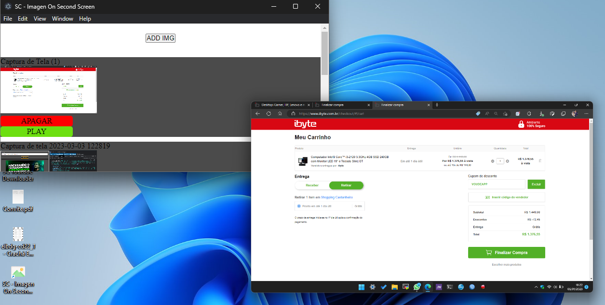

# SC-Imagen-On-Second-Screen

App to reproduce exibir on a second screen. => App to display images on second screen.



## Como usar

```bash
git clone https://github.com/saulotarsobc/SC-Imagen-Second-Screen.git
cd SC-Imagen-Second-Screen
yarn install;
yarn start;
# para gerar um instalor windows
yarn win;
# o .exe estará da pasra 'dist'
```
